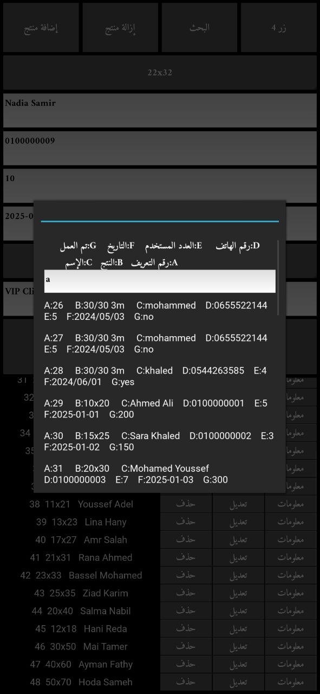

# Rental Management System

This is a rental management system built with Python using the Kivy framework. It allows users to manage products for rent, including adding, updating, and deleting items, as well as tracking their rental status.

## Features

- Add new rental products with details such as name, description, price, and availability.
- Update or delete existing rental products.
- View a list of all rental products.
- Track rental status (rented or available).
- Simple and intuitive user interface built using Kivy.

## Requirements

- Python 3.x
- Kivy (Install with `pip install kivy`)
- arabic_reshaper (Install with `pip install arabic_reshaper`)

## Installation

1. Clone this repository or download the source code.
2. Install the required dependencies:
   ```bash
   pip install kivy
   pip install arabic_reshaper

## App Screenshots

  
  


